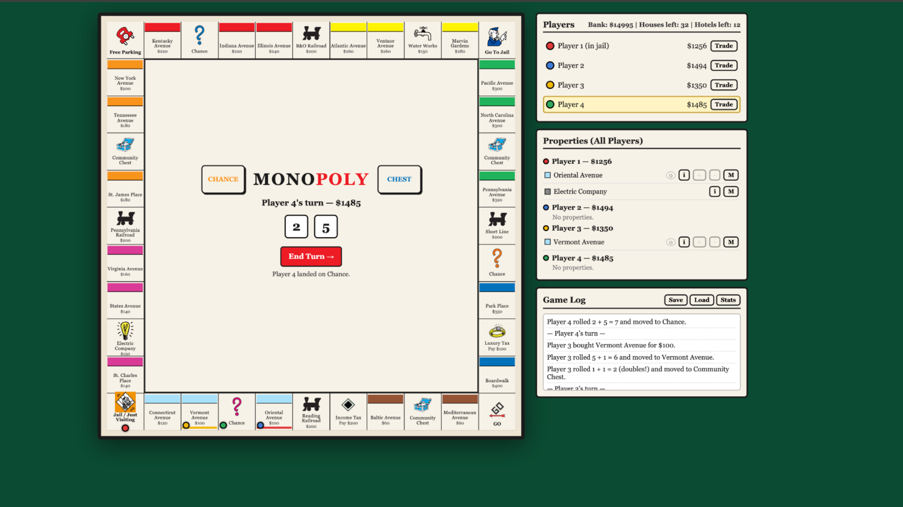

# Monopoly

## The Game:
For our final project, we coded a game of Monopoly that could be played with four players locally, or against bots. The bots were programmed by informing them about popular Monopoly strategies and teaching them how to play essentially perfectly. Sometimes the bots even taught themselves new strategies. These include using all homes instead of upgrading to hotels so that players can’t build houses, and sometimes playing extremely defensive and annoying games that prevent players from building monopolies by always refusing to sell a blocking property.

**In addition to the bots, we coded multiple features of Monopoly such as:**

* a trading system that goes all ways with counteroffers
* markers that show who owns certain properties
* working chance and community chest cards
* working dice
* home/hotel building
* all functional spaces such as the jail, chance, chest, and GO spaces
* and finally, monopoly online, where you create rooms and can play with your freinds. To do this, the room creater is player 1, and whoever joins seccond is player 2, and so on. Remaining seats can be filled with bots. 

**Convenient Addons:**

* a visual that shows what players own and how much money they have
* a stats page to see the amount of moves, how many people landed on certain spaces, the amount of trades, and how money has been moved around between players
* a game log that shows moves, trades made, rent paid, and even a feature that allows you to save a game and go back to that moment with a load button.
## How it Runs/Notes:

**Link to the Game:**
[Monopoly](https://monopoly-game-peach.vercel.app/)

If you want to run it locally, you must download flask to do so. Our project uses it.
## Final Thoughts:
Overall, we found our app interseting because we had full control of what we wanted our app to be. It was amazing being able to playtest our Monopoly game and change the features as we played to see if we could improve it. We also found the bots behavior interesting. When we initially programmed the bot, we only gave it some recommended strategies for the early game and how to make logical decisions but we found that as the bot played, it taught itself how to play better and it implemented its own strategies that we didn't even think about. But anyway this was a fun project and it helped us learn how to program basic game mechanics.
